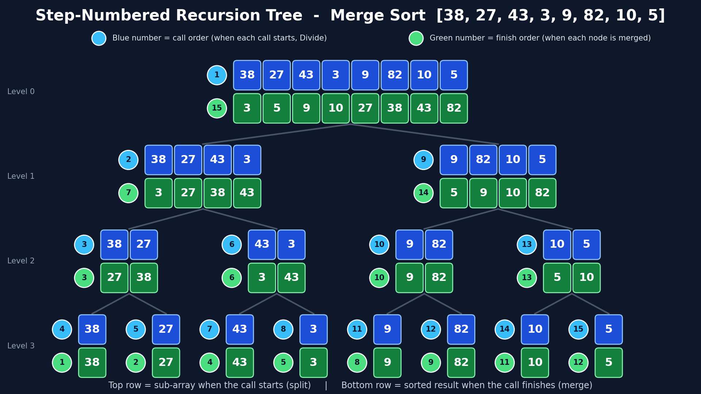

# Recursion Tree for Merge Sort
**Unit I – Algorithm Analysis | Project 2**

## Description
This project implements **Merge Sort** on an array of 8 elements and visualizes its **recursion tree**
(how the array is split and merged back). The picture is drawn directly from the steps recorded while
the algorithm runs, so it always matches the code. The visualizations were generated using an AI tool
(Claude) through prompt engineering.

## Algorithm
```
MERGE-SORT(A, low, high)
1.  if high - low <= 1          // 0 or 1 element
2.      return                  // already sorted (base case)
3.  mid = (low + high) / 2
4.  MERGE-SORT(A, low, mid)     // sort left half
5.  MERGE-SORT(A, mid, high)    // sort right half
6.  MERGE(A, low, mid, high)    // combine the two sorted halves

MERGE(A, low, mid, high)
1.  L = A[low .. mid-1]         // copy of left half
2.  R = A[mid .. high-1]        // copy of right half
3.  i = 0, j = 0, k = low
4.  while i < size of L and j < size of R
5.      if L[i] <= R[j]
6.          A[k] = L[i];  i = i + 1
7.      else
8.          A[k] = R[j];  j = j + 1
9.      k = k + 1
10. copy any remaining elements of L into A
11. copy any remaining elements of R into A
```
**In simple words:** split the array in halves until each piece has 1 element (already sorted), then
merge pieces back two at a time, always taking the smaller front number first.

**Complexity:** T(n) = 2T(n/2) + O(n) = **O(n log n)** time, O(n) extra space.

## Prompt Used
> "Draw a recursion tree for Merge Sort dividing an array of 8 elements."

The prompts used for the pseudocode, code and visualizations are listed in [`Prompt.txt`](Prompt.txt).

## Output
**1. Visualization picture** – [`Visualization/Visualization.png`](Visualization/Visualization.png)



**2. Interactive step-by-step visualizer** – [▶️ Open Merge Sort Visualizer](https://24wh1a0541-ux.github.io/DAAPROJECT/Unit1_AlgorithmAnalysis/Visualization/MergeSort_Interactive.html)

It has Play / Pause, Next / Back, a step slider, a speed control, and you can type your own 8 numbers.

**3. Presentation** – [`Presentation.docx`](Presentation.docx) explains the whole process step by step using the picture.

## Short Explanation
- Each pair of rows in the picture is one recursive call. **Top row (blue)** = the sub-array when the call
  starts (Divide). **Bottom row (green)** = the sorted result when the call finishes (Merge).
- The array is split 8 → 4 + 4 → 2 + 2 + 2 + 2 → 8 single elements (3 levels, log₂ 8 = 3), then merged
  back up into `[3, 5, 9, 10, 27, 38, 43, 82]`.
- The **blue circles** show the order in which the calls start and the **green circles** show the order
  in which they finish. The full walk-through is in `Presentation.docx`.
- Each level does about n = 8 work and there are 3 levels, so the total is O(n log n).

## How to Run
```bash
pip install matplotlib
python3 Project2_MergeSortTree.py     # prints before/after and creates Visualization/Visualization.png
```
To try other numbers, change `data` at the bottom of `Project2_MergeSortTree.py` (keep 8 elements),
or type them into the interactive visualizer.

## Folder Structure
```
Unit1_AlgorithmAnalysis/
├── Project2_MergeSortTree.py
├── Prompt.txt
├── Presentation.docx
├── Visualization/
│   ├── Visualization.png
│   └── MergeSort_Interactive.html
└── README.md
```

## Learning Outcome
- Understood recursive divide and conquer and how a recursion tree represents it.
- Understood why Merge Sort runs in O(n log n) time.
- Learned prompt-based visualization.
- Practiced GitHub documentation.
